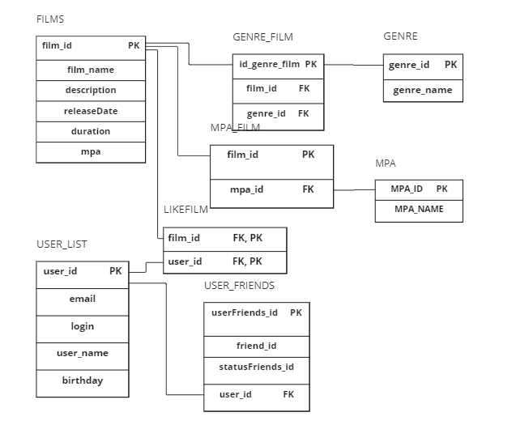

# Рейтинг фильмов  
Приложение выполняет поиск фильмов по жанрам и рейтингу(рейтинг расчитывается по лайкам от других пользователей).  
Приложение написано на Java:
```java
public class FilmorateApplication {
	public static void main(String[] args) {
		SpringApplication.run(FilmorateApplication.class, args);
	}
}
```
## Функциональность
### FilmController
**[POST] addFilm** //добавление фильма  
**[PUT] updateFilm** //обновление фильма  
**[PUT] createFilmLike** //пользователь ставит like  
**[GET] getFilms** //список фильмов      
**[GET] getFilmId** //фильм по ID    
**[GET] getBestPopular** //список по популярности(рейтингу)      
**[DELETE] deleteLike** //удаление like  
### UserController
**[POST] createUser** //создание пользователя      
**[PUT] updateUser** //обновление пользователя    
**[PUT] createUserFriends** //добавление, изменение друзей пользователя    
**[GET] getUserFriends** //список друзей пользователя  
**[GET] getUserAndOtherUserFriends** //список общих друзей  
**[DELETE] deleteUserFriends** //удаление друзей  

## Стек 
Java 11, Spring Framework, Maven, Lombok, JDBS, REST, БД H2, SQL, Junit.

## Развертываение проекта
1. Установить JDK amazon coretto 11 [скачать](https://corretto.aws/downloads/latest/amazon-corretto-11-x64-windows-jdk.msi)    
2. Установить Intellej IDEA [скачать](https://www.jetbrains.com/ru-ru/idea/download/download-thanks.html?platform=windows&code=IIC)  
3. Настроить БД H2   
```server.port=8080
logging.level.ru.yandex.practicum.filmorate=debug
spring.sql.init.mode=always
spring.datasource.url=jdbc:h2:file:./db/filmorate
spring.datasource.driverClassName=org.h2.Driver
spring.datasource.username=sa
spring.datasource.password=password  

<dependency>  
<groupId>com.h2database</groupId>  
<artifactId>h2</artifactId>  
<scope>runtime</scope>  
</dependency>  
```
4. Запустить файл shema.sql для создания БД
5. Проект готов к запуску!


## ER - диаграмма

